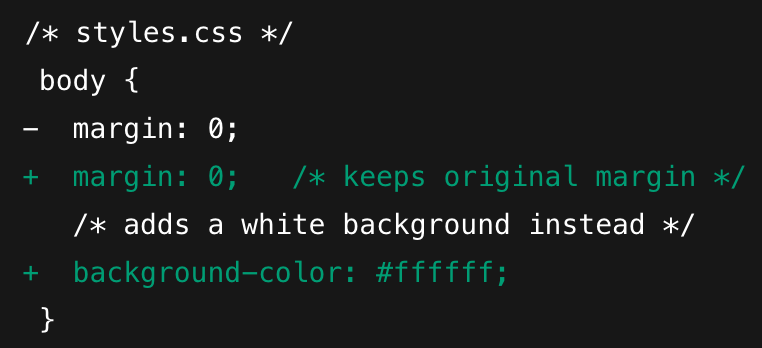
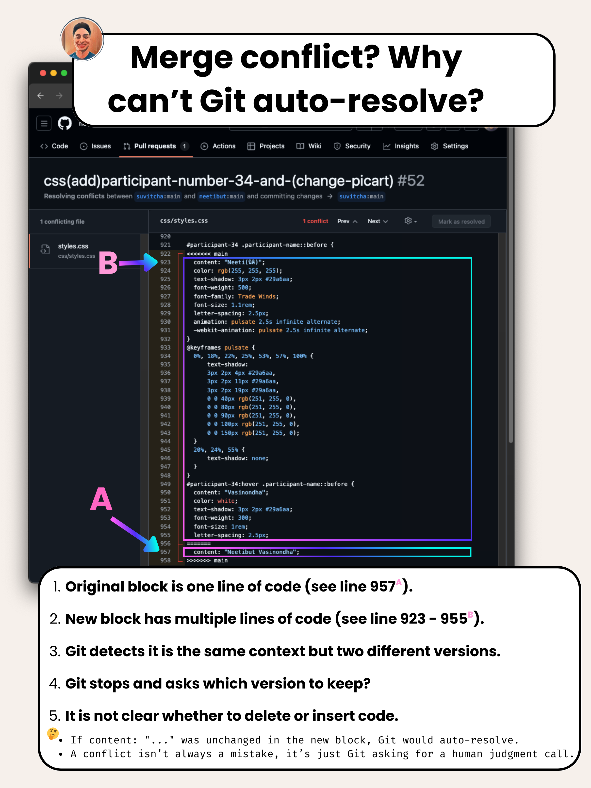

## Episode - Understanding why merge conflicts occur and how to resolve them.

> This guide is mostly in English but is aimed for Thai speakers.

Let's have a look at this Pull Request (PR) which caused a merge conflict.

1. Starting point (`styles.css` on both repos before either change)


2. Upstream (`original` repo) makes a change on `main` (commit `abc123`)


3.  Fork repo also changes the same file on its `main` (commit `def456`)



### Why Git can’t auto-resolve?

```
<<<<<<< HEAD
body {
    margin: 10px;
    background-color: #f9f9f9;
}
=======
body {
    margin: 0;
    background-color: #ffffff;
}
>>>>>>> fork/main
```

- Both branches **edited the exact same lines** (`margin` and/or `background-color`), but with different values.

- Git can’t know which version you want, so it stops and leaves the conflict markers for you to resolve manually.

- Choose which values to keep (or merge them), remove the `<<<<<<<`, `=======`, `>>>>>>>` markers

#### Question:

- ทำไมถึงเกิด conflict? ทำไมไม่ บันทึก(overwrite) ของเก่า ให้เป็นของใหม่ไปเลย?

#### Answer:

1. **Context overlap** - Git’s perspective they’re different contents in the same spot.

   - จากมุมมองของ Git เนื้อหาในบริเวณนั้นแตกต่างกันแต่อยู่ในจุดเดียวกัน จึงไม่สามารถรวมกันได้โดยอัตโนมัติ

2. **No clear “deletion vs insertion”** - A pure addition or pure deletion in one branch, with no edits on the other, would merge cleanly.

   - ถ้า ไม่ชัดเจนว่า code ชุดใหม่เป็นการ ลบของเก่าเป็นใหม่ หรือ เป็นการเพิ่มของใหม่เฉยๆ Git จึงหยุดและขอให้คุณเลือกว่าต้องการเก็บส่วนไหน

As long as two lines differ in the same place, Git will stop and ask you to resolve, regardless of branches or authors.

## Now that we understand why conflicts occurs, let's learn how to resolve them.

> Recommend watching at 1.2x speed or faster if you want! %%

Video Part 1 (5 mins) - https://www.loom.com/share/1c172bcdd0644d06a4f489e87390ede6?sid=81343050-74f8-4790-ae38-7beeb630a8d6

Video Part 2 (4 mins) - https://www.loom.com/share/d971cac7f9e34a9f9f091c06967ba86a?sid=4820fb60-7506-4024-9051-abe5682504b2

TL;DR



Congratulations! You are one step closer to Git proficiency 🙌
